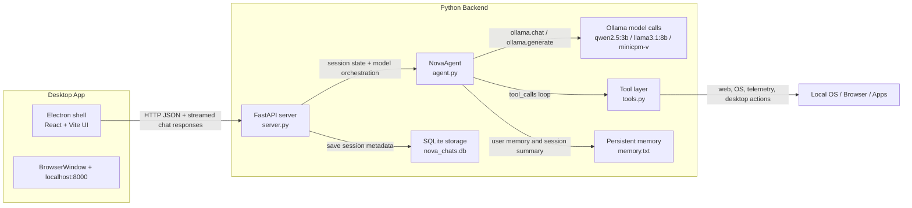

<p align="center">
  
</p>

# Nova — Local Desktop AI Assistant

Nova is a local-first desktop AI assistant that combines a Python backend, Ollama-hosted local models, a tool-calling agent, and a desktop UI for chat, file understanding, and basic OS/browser automation. The repository is a working prototype for running AI assistance entirely on a local machine while persisting chat/session state and providing a user-facing app shell for desktop use.

## Overview

The core idea behind Nova is simple: keep the model and the agent runtime local, while exposing a small but practical set of tools for research, system inspection, memory persistence, and limited desktop control. The backend is a FastAPI service that manages chat sessions and delegates to a `NovaAgent` class built around Ollama model calls. The agent can invoke tools such as web search, webpage scraping, local system telemetry, terminal commands, browser navigation, and app launching, with all orchestration happening in Python.

This is not a generic chatbot wrapper. It is an engineering project centered on operational constraints: local inference, constrained VRAM, streamed LLM responses, short-term memory summarization, persisted session state, and tool execution on the host machine.

## Key Features

- Local inference via Ollama with a fast model and a deeper reasoning model
- Tool calling through the Ollama chat API, with results fed back into the model loop
- SQLite-backed session persistence for chat history and saved memory summaries
- Plain-text persistent user memory in `memory.txt` for long-lived preferences/context
- Image and PDF attachment handling in the chat flow
- Streaming responses from backend to frontend for a more interactive UX
- Desktop packaging through Electron, with the Python service spawned locally
- Browser, OS, app-launch, and UI automation primitives implemented via `pyautogui`, `webbrowser`, and `subprocess`

## Architecture



### Major components

- `server.py` is the main backend entry point. It creates the FastAPI app, initializes SQLite tables, exposes the chat endpoints, stores session metadata/messages, and serves the frontend build if present.
- `agent.py` contains `NovaAgent`, the orchestration layer. It maintains conversation history, injects system prompts and memory, chooses the active model, runs the tool-calling loop, and performs short-term memory compression.
- `tools.py` defines the practical tool set: web search, scraping, telemetry, terminal execution, Notepad injection, browser actions, app launch attempts, Spotify, Discord, Gmail drafting, and generic OS actions.
- `nova-frontend/` contains the React UI and the Electron wrapper. The React app communicates with the backend using direct HTTP fetch calls to `http://<hostname>:8000/api/...`.
- `memory.txt` is a plain text memory file used as a persistent user profile and project context store.
- `nova_chats.db` stores chat sessions and messages, with a per-session summary field.

### Data flow

1. The user sends a prompt from the React frontend.
2. The frontend POSTs to `/api/chat` with a `session_id`, optional image/PDF payload, and a model toggle.
3. The FastAPI backend creates or reuses a `NovaAgent` for the session, then streams chunks from `agent.chat_stream(...)` back to the client.
4. During the model loop, Ollama may emit tool calls.
5. The backend invokes the relevant function from `tools.py` and feeds the tool result back into the conversation.
6. Session metadata and message history are persisted in SQLite, and the current session memory summary is updated as the conversation grows.

## AI / Model Architecture

Nova uses Ollama as the local LLM runtime. The repository explicitly references the following model names:

- `qwen2.5:3b` — the default fast model
- `llama3.1:8b` — the deeper reasoning model
- `minicpm-v` — vision model used when image input is attached

The selection logic is simple and concrete:

- `FAST_MODEL = "qwen2.5:3b"`
- `DEEP_MODEL = "llama3.1:8b"`
- `use_supernova` toggles between the two in the backend

The `NovaAgent.chat_stream(...)` method loads the active model via `ollama.chat(...)` with tool definitions and context options such as `num_ctx` and `num_predict`. For image inputs, it explicitly evicts the current model with `ollama.generate(model=active_model, prompt='', keep_alive=0)` before loading `minicpm-v`, then clears the model again after processing. That is the clearest evidence of memory/VRAM management in the repository.

Important engineering constraints visible in the code:

- The app is designed around local models rather than remote hosted APIs.
- Model switching is implemented as a practical toggle, not as a broad abstraction layer or dynamic model registry.
- There is no custom quantization pipeline, no CUDA-specific code path, and no custom GGUF loader. The code relies on Ollama's runtime and local model management.
- Monitoring of GPU state is included through `GPUtil` in `get_system_telemetry()`, but it is primarily for system awareness rather than an advanced optimization framework.

## Agent & Tool System

The orchestration model is a classic tool-calling loop:

- `NovaAgent.chat_stream(...)` sends the current conversation to `ollama.chat(...)`.
- `tools=[...]` is passed directly to the tool-calling API.
- If `response.message.tool_calls` is present, the code iterates over the tool invocations and executes the matching entry in `AVAILABLE_TOOLS`.
- The tool result is appended back into the conversation as a `role: "tool"` message.
- The agent repeats the loop until it receives a direct final answer or hits a search/reasoning limit.

This is a useful separation of concerns:

- The model decides when a tool is needed.
- The Python code dispatches the tool call.
- The tool return value is fed back into the model context.

Available tools in the repository include:

- `search_the_web` — DuckDuckGo search results
- `scrape_webpage` — HTML extraction from a URL
- `search_news` — recent news search
- `search_images` — image search result
- `check_system_status` — current timestamp / system status
- `get_system_telemetry` — CPU, RAM, battery, and GPU data using `psutil` and `GPUtil`
- `execute_os_action` — browser search and app launch
- `save_to_memory` — append information to `memory.txt`
- `run_terminal_command` — run shell commands
- `type_in_notepad` — open Notepad and paste text
- `draft_gmail` / `send_gmail` — Gmail compose/send operations via UI automation
- `play_spotify` — open Spotify search and click play
- `message_discord` — open Discord and DM a user

Most of these are best understood as local desktop automation helpers rather than remote API connectors. The repository does not implement a formal agent framework or planner abstraction; it is a direct, event-driven tool-calling loop over Ollama responses.

## Memory & Persistence

Nova stores state in two distinct ways:

1. `memory.txt` — persistent user memory file
   - Contains profile information, project notes, and user preferences.
   - Loaded on startup in `NovaAgent.__init__()` and appended to the system prompt.
   - Used as long-lived memory that persists across sessions.

2. `nova_chats.db` — SQLite database used by the backend
   - `sessions`: stores `id`, `title`, `updated_at`, and `memory`
   - `messages`: stores chat message rows with `session_id`, `role`, `content`, and timestamp
   - The backend updates session timestamp and memory on each interaction

The session summary is a rough short-term memory compression mechanism. When the conversation grows, `NovaAgent._compress_memory(...)` reduces recent context into a summary and resets the conversation history with a recap plus recent messages. This is a lightweight memory strategy rather than a full RAG or vector database stack.

## Desktop & Application Integration

The repository includes several forms of desktop integration that are actually implemented:

- Browser search and app launch via `webbrowser` and `os.system("start ...")`
- Local UI automation via `pyautogui` for Gmail, Spotify, Discord, and Notepad
- System telemetry collection for CPU, RAM, battery, and GPU status
- Terminal command execution via `subprocess.run(..., shell=True)`

The app also has explicit OS/browser workflow boundaries:

- `execute_os_action` is documented as being for browser search and app launch only.
- `draft_gmail` and `send_gmail` are designed to locate UI elements visually using screenshots/templates found under `templates/`.
- `play_spotify` and `message_discord` depend on screen matching and UI interaction patterns.

This is not a secure automation framework; it is a practical local desktop helper that relies on desktop UI access and OS-level commands.

## Frontend

The primary frontend is in `nova-frontend/` and uses:

- React
- Vite
- TypeScript
- Electron

The React app is responsible for:

- listing chat sessions
- rendering messages and streamed responses
- handling file attachments (images and PDFs)
- model selection (`Nova` vs `SuperNova`)
- showing session memory summaries
- deleting chats and reloading historical conversations

The frontend talks to the backend with plain fetch requests, e.g.:

- `POST http://<hostname>:8000/api/chat`
- `GET http://<hostname>:8000/api/sessions`
- `GET http://<hostname>:8000/api/chat/<session_id>`
- `GET http://<hostname>:8000/api/memory/<session_id>`

The backend streams the assistant response as plain text, which the frontend appends to the live message content in real time.

The repository also contains a standalone `main.py` CustomTkinter app, which appears to be a separate prototype/UI implementation. The packaged desktop flow, however, is driven by Electron and the Python backend `server.py`.

## Tech Stack

| Layer | Technology |
| --- | --- |
| Backend | Python, FastAPI, Uvicorn |
| Local model runtime | Ollama |
| Agent orchestration | Python custom loop with `ollama.chat` tool calling |
| Persistence | SQLite |
| User memory | plain-text `memory.txt` |
| Desktop UI shell | Electron |
| Frontend | React, TypeScript, Vite |
| UI automation | `pyautogui`, `webbrowser`, `subprocess`, OS commands |
| Search / scraping | `ddgs`, `requests`, `BeautifulSoup` |
| System telemetry | `psutil`, `GPUtil` |
| PDF processing | `PyMuPDF` (`fitz`) |
| GUI prototype | `customtkinter` |

## Repository Structure

```text
NovaAI/
├── agent.py
├── main.py
├── memory.txt
├── requirements.txt
├── server.py
├── tools.py
├── README.md
├── nova-frontend/
│   ├── main.js
│   ├── package.json
│   ├── vite.config.ts
│   ├── eslint.config.js
│   ├── index.html
│   ├── public/
│   ├── src/
│   └── release/
│       └── builder-effective-config.yaml
├── templates/
│   ├── gmail_compose.png
│   ├── gmail_send.png
│   └── spotify_play.png
└── .gitignore
```

This tree reflects the source and runtime files that matter for understanding the implementation. Generated build artifacts, caches, virtual environments, and large binary packaging outputs are intentionally omitted.

## Setup

The project expects a working local Python environment and a local Ollama installation.

### 1) Install Python dependencies

```bash
pip install -r requirements.txt
```

### 2) Install Node dependencies for the frontend

```bash
cd nova-frontend
npm install
```

### 3) Ensure Ollama models are available locally

The repository references these model names directly:

```bash
ollama pull qwen2.5:3b
ollama pull llama3.1:8b
ollama pull minicpm-v
```

The app will not work as intended if the Ollama daemon is not running and these models are not present locally.

## Usage

### Run the backend manually

From the project root:

```bash
uvicorn server:app --host 0.0.0.0 --port 8000
```

### Run the frontend in development mode

```bash
cd nova-frontend
npm run dev -- --host
```

### Run the packaged desktop app

```bash
cd nova-frontend
npm run desktop
```

### Build a desktop package

```bash
cd nova-frontend
npm run package
```

## Configuration

There is no `.env`-based secret management in the repository. The app relies on local files and local runtime state:

- `memory.txt` for persistent user memory
- `nova_chats.db` for chat and session state
- a running local Ollama daemon for model inference
- local OS/browser/app automation permissions on the user machine

The only meaningful runtime configuration is the local model set and the ability for the Python service to run on the host machine. There are no credentialed external API keys checked in to the repository.

## Engineering Challenges / Design Decisions

### 1) Constrained local inference

Problem: local models are limited by machine resources and model size.

Approach: the app exposes two model tiers, `Nova` and `SuperNova`, so the user can choose a lighter or deeper inference path depending on the task.

Why it matters: this mirrors a realistic local-AI constraint model where inference quality, memory use, and latency are all trade-offs.

### 2) GPU / VRAM management

Problem: switching between large text models and a vision model can compete for limited VRAM.

Approach: the code explicitly evicts the active model using `keep_alive=0` before loading `minicpm-v`, then clears it again after usage.

Why it matters: this is a practical, low-level memory management strategy for a constrained desktop environment.

### 3) Streaming responses vs. full-block generation

Problem: chat UX benefits from immediate feedback, but the model output is generated incrementally.

Approach: `agent.chat_stream(...)` yields chunks from the LLM response as they arrive, and the frontend appends them to the live message.

Why it matters: it reduces perceived latency and improves interactive responsiveness.

### 4) Persistent state for multi-session use

Problem: chat apps need to retain history and summaries without losing context across restarts.

Approach: the FastAPI backend stores session metadata/messages in SQLite and tracks a memory summary per session, while the agent also loads a persistent user preference file from `memory.txt`.

Why it matters: this is a simple but useful local persistence layer for a desktop-first assistant.

### 5) Tool-calling under a constrained model loop

Problem: the model can request tools, but those tools need deterministic execution and safe result formatting.

Approach: the agent loops over `response.message.tool_calls`, dispatches calls to Python functions, and adds the result back into the conversation.

Why it matters: this creates a practical action/information loop without introducing a heavyweight orchestration framework.

### 6) Desktop integration without a centralized automation framework

Problem: OS and app controls are inherently platform- and UI-dependent.

Approach: the project uses OS commands, browser launchers, `pyautogui`, and screenshot-based visual matching for apps like Gmail, Spotify, Discord, and Notepad.

Why it matters: it fits the project’s local desktop AI assistant use case, even though it is less robust than a structured automation platform.

### 7) API failure / fallback handling

Problem: web search, scraping, and automation actions may fail or time out.

Approach: functions consistently return structured JSON with explicit error payloads, and the agent is designed to treat tool output as part of the conversational loop rather than a guaranteed success path.

Why it matters: this makes failure modes visible to the model and to the user rather than silently failing inside the desktop app.

### 8) Remote information retrieval under local constraints

Problem: the assistant needs current information, but it is running locally and not backed by a hosted search API.

Approach: it uses DuckDuckGo-based search and webpage scraping, plus explicit source citation requirements, to gather current facts and summarize them for the user.

Why it matters: it keeps the architecture self-contained while still making the assistant usable for research and fact checking within the local environment.

## Project Status

Nova is a functional local prototype and engineering demo rather than a polished production product. The repository demonstrates a complete local AI workflow: a Python backend, local model integration through Ollama, a React frontend, and desktop automation primitives. It is useful as a proof of concept for local AI assistance, agentic desktop workflows, and persistent conversational memory on a single machine.

It is best described as a research-and-prototyping project with practical automation features, not a hardened desktop application or a turnkey enterprise system.

## Privacy & Security Notes

- The system is local-first in the sense that the model runtime, session state, and most orchestration live on the user’s machine.
- Chat history and session metadata are stored in SQLite locally via `nova_chats.db`.
- User preferences and project context are stored in `memory.txt` and loaded into the system prompt.
- The project does not include a secret manager or a credential vault. Any real credentials, tokens, or account details must be provided by the user’s own runtime environment or handled inside the local desktop OS workflow.
- Browser and app actions are executed via local OS commands and UI automation tools. These actions require user-level permissions and should be used deliberately.
- The repository does not implement advanced auth, sandboxing, or enterprise security controls.

## Disclaimer

Because Nova can launch local applications, execute terminal commands, search the browser, and interact with desktop UI flows, it should be used with care. User confirmation is especially important for actions that send messages, open web pages, create drafts, or manipulate external applications. The project is a local automation prototype and it should not be treated as a hardened, fully autonomous system.

## Author

Yatharth Singh
